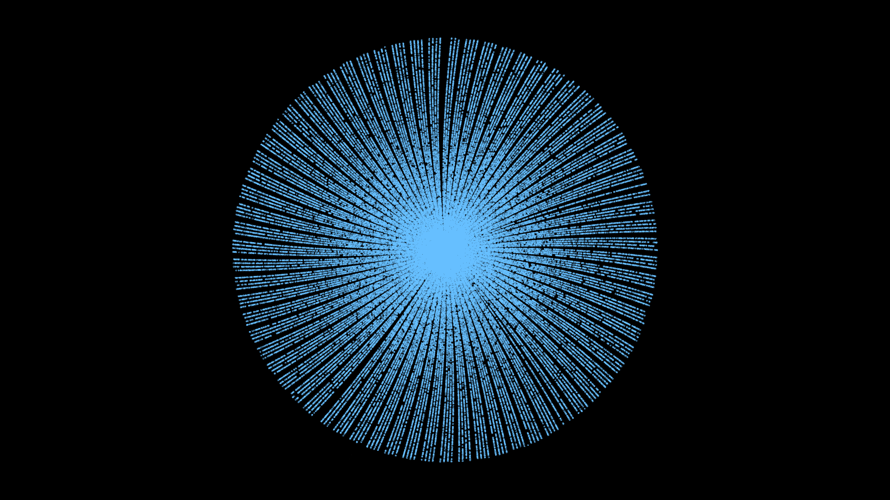

# piral

A Visualisation of an Archimedean Spiral Using Prime Numbers





## Usage

```bash
$ go run main.go
```

## Keybinds

|       Key        |                                    Action                                    |
| :--------------: | :--------------------------------------------------------------------------: |
| <kbd>Space</kbd> |                              Toggle Generation                               |
|   <kbd>s</kbd>   |                               Skip Generation                                |
|   <kbd>r</kbd>   |                                    Reset                                     |
|   <kbd>z</kbd>   |                           Toggle automatic zooming                           |
|   <kbd>x</kbd>   | Toggle rotation (can cause performance issues when using a high prime count) |

You can scroll to zoom in and out

## TODO

- [x] Don't use `rl.DrawCircle`
- [x] Optimize performance when rendering a high prime count
- [ ] Sliders for adjusting speed of rotation and zooming after launching
- [ ] Reimplement Eratosthenes' Sieve to be more effecient
- [ ] Zooming in under cursor (would require changing the origin of rendering)
- [ ] Stop zooming out earlier (compute offset from edges of the spiral to the borders of the screen)
- [ ] Render to video (?)

## References

- <https://www.youtube.com/watch?v=EK32jo7i5LQ>
